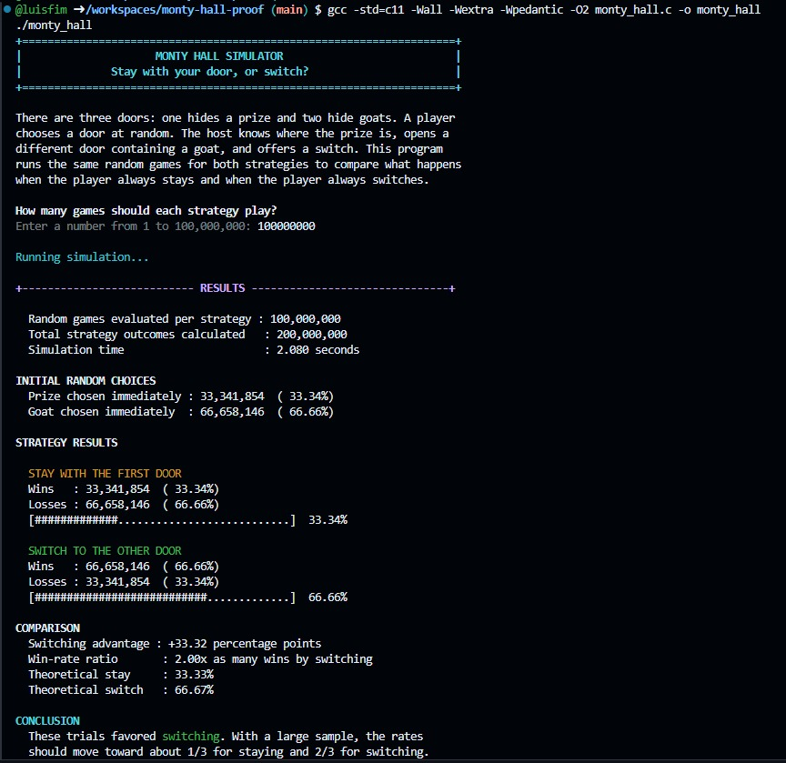

# Monty Hall Simulator

A small terminal program written in C that uses randomized simulation to demonstrate one of probability theory's most counterintuitive results: in the Monty Hall problem, **switching doors wins approximately two-thirds of the time**, while staying with the first choice wins approximately one-third of the time.

## Screenshot

<p align="left">
  
</p>

## Why I built this

I learned about the Monty Hall problem a long time ago, but its explanation never completely made sense in my head. The result is extremely counterintuitive: after one losing door is opened, only two closed doors remain, so it feels as though each one should have a 50% chance.

I could follow the mathematical explanation, but part of me still did not fully believe it. A simulation was the only thing that could truly convince me that the result was real, so I built one myself.

## The problem

Imagine a game with three closed doors:

- One door hides a prize.
- Two doors hide goats.
- The player chooses one door.
- The host knows where the prize is.
- The host opens a different door and always reveals a goat.
- The player may stay with the original choice or switch to the only other closed door.

The question is:

> Is it better to stay, switch, or does it make no difference?

### Staying

Staying wins only when the first random choice was already correct:

P(win by staying) = 1/3 = approximately 33.33%

### Switching

Switching wins whenever the first random choice was wrong. That happens for either of the two goat doors:

P(win by switching) = 2/3 = approximately 66.67%

| Initial choice | Probability | Stay | Switch |
|---|---:|---:|---:|
| Prize | \(1/3\) | Win | Lose |
| Goat | \(2/3\) | Lose | Win |

The host's knowledge is the important detail. The host is not opening a random door that might contain the prize. The host deliberately removes a losing option, concentrating the original \(2/3\) probability of the two unchosen doors onto the single unopened door that remains.

Another way to visualize it is to imagine 100 doors. You choose one, with only a 1% chance of being correct. The host then opens 98 losing doors and leaves your door plus one other door closed. Your first door does not suddenly become a 50% choice; it is still the unlikely 1% choice. The other closed door carries the remaining 99% chance.

## Build and run

### Linux and macOS

```bash
gcc -std=c11 -Wall -Wextra -Wpedantic -O2 monty_hall.c -o monty_hall
./monty_hall
```

### Windows with MinGW/GCC

```powershell
gcc -std=c11 -Wall -Wextra -Wpedantic -O2 monty_hall.c -o monty_hall.exe
.\monty_hall.exe
```

No external libraries are required.

### Disable terminal colors

The interface uses ANSI colors where supported. Set the [`NO_COLOR`](https://no-color.org/) environment variable to disable them.

Linux or macOS:

```bash
NO_COLOR=1 ./monty_hall
```

Windows PowerShell:

```powershell
$env:NO_COLOR = "1"
.\monty_hall.exe
```

## Background and sources

The puzzle is modeled after the American television game show *Let's Make a Deal* and is named after its longtime host, Monty Hall. Statistician Steve Selvin presented the problem in game-show form in letters published in [*The American Statistician*](https://www.jstor.org/stable/2683689) in 1975. It became widely known after Marilyn vos Savant answered a reader's version of the puzzle in her *Parade* column in 1990.
